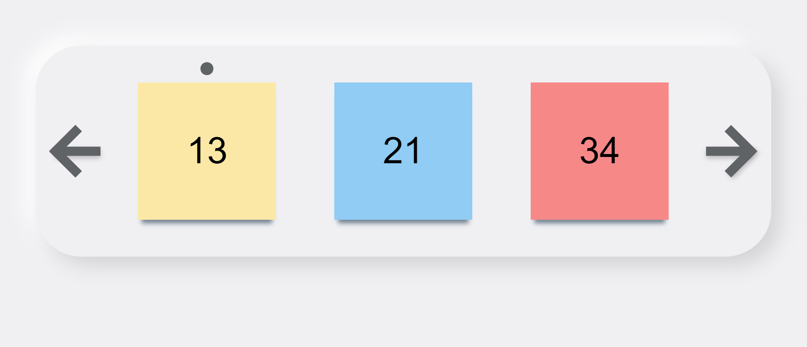

# Ряд Фибоначчи с переключателями



## Описание

Интерфейс представляет собой окно с выводом трех чисел ряда Фибоначчи и переключатели в виде стрелок. 

С помощью стрелок происходит управление отображаемых элементов (по клику на правую стрелку получаем следующий элемент, остальные сдвигаются влево, по клику на левую стрелку получаем предыдущий элемент, все остальные сдвигаются вправо).

При наведении на карточку числа сверху отображается бегунок.

Все значения записываются в localStorage.

## Технологии в проекте

HTML, CSS, JavaScript, React JS

## Настройка проекта

```
cd my-app
npm start
```
## План выполнения проекта

1. Инициализация реакт приложения

```
npx create-react-app my-app
```

2. Верстка страницы
3. Создание компонента карточки 
4. Формула получения чисел ряда Фибоначчи
5. Функции для работы стрелок
6. Стилизация проекта в css
7. Создание бегунка для эффекта наведения на карточку
8. Реализация сохранения значений в хранилище localStorage
9. Реализация адаптивности с помощью медиазапросов в css